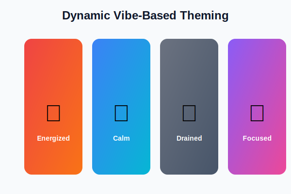
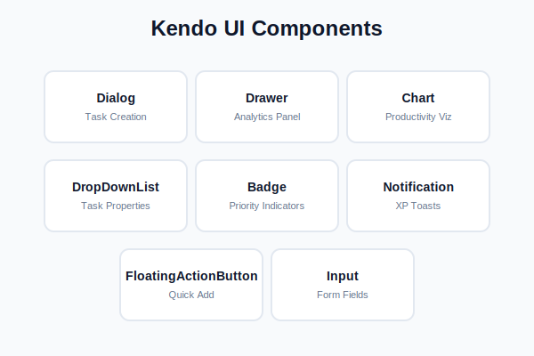

<div align="center">


**A mood-aware task manager that matches work to your energy level**

[](https://react.dev/)
[](https://www.typescriptlang.org/)
[](https://www.telerik.com/kendo-react-ui)

[Live Demo](#) | [Report Issue](https://github.com/Tasfia-17/blink/issues)

</div>

---

## The Problem

You have 47 tasks. You are exhausted at 4pm. Your task manager shows them all equally.

**Which one should you actually do right now?**

Traditional task managers ignore your current mental state. They treat 9am-you and 4pm-you the same, leading to decision paralysis and procrastination.

---

## The Solution

**Vibe Check** asks one question: "How is your energy right now?"

Then it shows you only the tasks that match your current state, while the entire UI transforms to reflect your mood.

<div align="center">



</div>

### The Unique Twist

The UI has emotional intelligence. Select your vibe and watch the entire interface transform with warm, inviting colors and smooth animations that match your energy state.

---

## Features

### Dynamic Vibe-Based Theming

<table>
<tr>
<td width="25%" align="center">
<br>
<strong>Energized</strong><br>
<small>High-energy creative work</small>
</td>
<td width="25%" align="center">
<br>
<strong>Calm</strong><br>
<small>Medium-effort tasks</small>
</td>
<td width="25%" align="center">
<br>
<strong>Drained</strong><br>
<small>Low-effort admin work</small>
</td>
<td width="25%" align="center">
<br>
<strong>Focused</strong><br>
<small>Deep concentration work</small>
</td>
</tr>
</table>

The entire interface adapts to your selected energy state with warm, modern color palettes and smooth gradient transitions.

### Smart Task Filtering

Tasks are categorized by energy requirement (high/medium/low). When you select a vibe, only matching tasks appear, eliminating decision fatigue.

### Gamification System

- **XP Points**: Earn 15-50 XP per completed task based on difficulty
- **Bonus Multipliers**: Get 1.5x XP for completing tasks in matching vibes
- **Level Progression**: Advance through levels as you build consistency
- **Visual Feedback**: Instant notifications celebrate your progress

### Analytics Dashboard

Track your productivity patterns with Kendo Charts:

- Bar chart showing tasks completed by vibe
- Donut chart displaying energy distribution
- Quick stats for total completed and remaining tasks
- Insights into your most productive energy states

### Modern Design

- Warm color palettes (rose, orange, amber, pink)
- Smooth gradient transitions
- Framer Motion animations
- Fully responsive layout
- Custom scrollbars and hover states
- Clean, minimal interface

---

## Tech Stack

### Built with Progress UI Generator

This project was scaffolded using the **Progress UI Generator**, providing:

- Initial component structure and layout
- Kendo UI integration setup
- Responsive grid system
- Accessibility foundations

### Kendo UI for React Components

<div align="center">



</div>

| Component | Purpose | Why Kendo |
|-----------|---------|-----------|
| **Dialog** | Task creation modal | Built-in overlay management, focus trapping, accessibility |
| **Drawer** | Analytics side panel | Smooth slide-in animations, overlay mode |
| **Chart** | Productivity visualizations | Bar and donut charts with minimal configuration |
| **DropDownList** | Energy/priority selectors | Better UX than native select elements |
| **Badge** | Priority indicators | Visual hierarchy out of the box |
| **Notification** | XP gain toasts | Non-intrusive, auto-dismiss, positioned |
| **Input** | Form fields | Consistent styling and validation |
| **Button** | Actions throughout | Multiple variants for visual hierarchy |

### Core Technologies

- **React 19** with Hooks for state management
- **TypeScript 5.9** for type safety
- **Tailwind CSS 4** for utility-first styling
- **Framer Motion** for smooth animations
- **Vite 7** for lightning-fast builds
- **LocalStorage** for client-side persistence

---

## Quick Start

### Prerequisites

- Node.js 18 or higher
- npm or yarn

### Installation

```bash
git clone https://github.com/Tasfia-17/blink.git
cd blink
npm install
npm run dev
```

Open [http://localhost:5173](http://localhost:5173) in your browser.

### Build for Production

```bash
npm run build
npm run preview
```

---

## Project Structure

```
src/
├── App.tsx              # Main app with vibe selector and task grid
├── TaskDialog.tsx       # Kendo Dialog for creating tasks
├── AnalyticsDrawer.tsx  # Kendo Drawer with Charts
├── types.ts             # TypeScript interfaces and vibe config
├── App.css              # Modern styles with warm colors
└── main.tsx             # React entry point

public/assets/
├── logo.svg             # Cute heart pulse logo
├── energized-icon.svg   # Lightning bolt animation
├── calm-icon.svg        # Water waves animation
├── drained-icon.svg     # Moon and stars animation
└── focused-icon.svg     # Target pulse animation
```

---

## Data Model

```typescript
interface Task {
  id: string;
  title: string;
  description: string;
  energyLevel: 'high' | 'medium' | 'low';
  estimatedMinutes: number;
  priority: 'urgent' | 'high' | 'medium' | 'low';
  completed: boolean;
  createdAt: number;
  completedAt?: number;
  completedInVibe?: Vibe;
  tags: string[];
}

interface VibeSession {
  vibe: Vibe;
  timestamp: number;
  tasksCompleted: number;
  xpEarned: number;
}
```

---

## Why This Showcases Kendo UI

### Rapid Development

Built in hours, not days, thanks to Progress UI Generator scaffolding and Kendo's comprehensive component library.

### Beyond Enterprise

Proves Kendo UI components work beautifully in consumer-grade applications with modern, warm aesthetics.

### Complex Made Simple

Charts, drawers, dialogs, and form controls work together seamlessly with minimal configuration.

### Production Ready

Built-in accessibility (ARIA attributes, keyboard navigation, screen reader support) and battle-tested reliability.

### Highly Customizable

Easy to override styles with Tailwind while maintaining Kendo's functionality and behavior.

---

## Design Philosophy

### Empathetic Design

Acknowledges that users are humans with fluctuating energy levels, not productivity robots. The UI adapts to your state rather than forcing you to adapt to it.

### Warm and Inviting

Uses warm color palettes (rose, orange, amber, pink) to create a friendly, approachable interface that reduces stress.

### Minimal Friction

No accounts, no onboarding, no configuration. Open the app, select your vibe, and start working.

### Visual Feedback

Every action provides immediate, delightful feedback through animations, color changes, and notifications.

---

## Use Cases

| User Type | Scenario |
|-----------|----------|
| **Developers** | Morning: High-energy architecture work. Afternoon: Low-energy code reviews |
| **Designers** | Energized: Creative concepting. Drained: Asset organization |
| **Writers** | Focused: Deep writing sessions. Calm: Editing and revisions |
| **Managers** | High-energy: Strategic planning. Low-energy: Email responses |
| **Anyone** | Who experiences energy fluctuations throughout the day |

---

## Roadmap

### Phase 1: Core Features (Complete)

- [x] Vibe selector with 4 energy states
- [x] Dynamic UI theming with warm colors
- [x] Smart task filtering
- [x] Task creation and management
- [x] XP and leveling system
- [x] Analytics dashboard with charts
- [x] LocalStorage persistence
- [x] Animated SVG icons

### Phase 2: Enhancements (Planned)

- [ ] Keyboard shortcuts for vibe switching
- [ ] Task templates for common workflows
- [ ] Time tracking integration
- [ ] Export analytics as PDF/CSV
- [ ] Dark/light mode toggle
- [ ] Custom vibe creation

### Phase 3: Advanced (Future)

- [ ] Optional cloud sync
- [ ] Team collaboration features
- [ ] Mobile PWA version
- [ ] Browser extension
- [ ] AI-powered task suggestions
- [ ] Calendar integration

---

## Contributing

Contributions are welcome! Please follow these steps:

1. Fork the repository
2. Create a feature branch (`git checkout -b feature/amazing-feature`)
3. Commit your changes (`git commit -m 'Add amazing feature'`)
4. Push to the branch (`git push origin feature/amazing-feature`)
5. Open a Pull Request

### Development Guidelines

- Maintain TypeScript strict mode
- Follow existing code style
- Keep components focused and minimal
- Test across different vibes
- Ensure accessibility standards

---

## License

MIT License. See [LICENSE](LICENSE) file for details.

---

## Acknowledgments

Built for the **Progress UI Generator Challenge**.

Special thanks to:

- Progress Software for Kendo UI for React
- The React team for an amazing framework
- Tailwind CSS for utility-first styling
- Framer Motion for delightful animations

---

<div align="center">


**Built with Progress UI Generator + Kendo UI for React**

[Star this repo](https://github.com/Tasfia-17/blink) if you find it useful!

</div>

---

## Features

### Dynamic Vibe-Based Theming

The entire interface adapts to your selected energy state:

- **Energized**: Fiery red/orange gradients, shows high-energy creative work
- **Calm**: Soothing blue/cyan gradients, shows medium-effort tasks
- **Drained**: Muted gray gradients, shows low-effort admin work
- **Focused**: Purple/pink gradients, shows deep work requiring concentration

### Smart Task Filtering

Tasks are categorized by energy requirement (high/medium/low). When you select a vibe, only matching tasks appear, eliminating decision fatigue.

### Gamification System

- **XP Points**: Earn 15-50 XP per completed task based on difficulty
- **Bonus Multipliers**: Get 1.5x XP for completing tasks in matching vibes
- **Level Progression**: Advance through levels as you build consistency
- **Visual Feedback**: Instant notifications celebrate your progress

### Analytics Dashboard

Track your productivity patterns with Kendo Charts:

- Bar chart showing tasks completed by vibe
- Donut chart displaying energy distribution
- Quick stats for total completed and remaining tasks
- Insights into your most productive energy states

### Modern Design

- Glassmorphism effects with backdrop blur
- Smooth 0.7s gradient transitions
- Framer Motion animations
- Fully responsive layout
- Custom scrollbars and hover states

---

## Tech Stack

### Built with Progress UI Generator

This project was scaffolded using the **Progress UI Generator**, providing:

- Initial component structure and layout
- Kendo UI integration setup
- Responsive grid system
- Accessibility foundations

### Kendo UI for React Components


| Component | Purpose | Why Kendo |
|-----------|---------|-----------|
| **Dialog** | Task creation modal | Built-in overlay management, focus trapping, accessibility |
| **Drawer** | Analytics side panel | Smooth slide-in animations, overlay mode |
| **Chart** | Productivity visualizations | Bar and donut charts with minimal configuration |
| **DropDownList** | Energy/priority selectors | Better UX than native select elements |
| **Badge** | Priority indicators | Visual hierarchy out of the box |
| **Notification** | XP gain toasts | Non-intrusive, auto-dismiss, positioned |
| **FloatingActionButton** | Quick task creation | Modern mobile-first pattern |
| **Input** | Form fields | Consistent styling and validation |
| **Button** | Actions throughout | Multiple variants for visual hierarchy |

### Core Technologies

- **React 19** with Hooks for state management
- **TypeScript 5.9** for type safety
- **Tailwind CSS 4** for utility-first styling
- **Framer Motion** for smooth animations
- **Vite 7** for lightning-fast builds
- **LocalStorage** for client-side persistence

---

## Quick Start

### Prerequisites

- Node.js 18 or higher
- npm or yarn

### Installation

```bash
git clone https://github.com/Tasfia-17/blink.git
cd blink
npm install
npm run dev
```

Open [http://localhost:5173](http://localhost:5173) in your browser.

### Build for Production

```bash
npm run build
npm run preview
```

---

## Project Structure

```
src/
├── App.tsx              # Main app with vibe selector and task grid
├── TaskDialog.tsx       # Kendo Dialog for creating tasks
├── AnalyticsDrawer.tsx  # Kendo Drawer with Charts
├── types.ts             # TypeScript interfaces and vibe config
├── App.css              # Modern styles (glassmorphism, gradients)
└── main.tsx             # React entry point
```

---

## Data Model

```typescript
interface Task {
  id: string;
  title: string;
  description: string;
  energyLevel: 'high' | 'medium' | 'low';
  estimatedMinutes: number;
  priority: 'urgent' | 'high' | 'medium' | 'low';
  completed: boolean;
  createdAt: number;
  completedAt?: number;
  completedInVibe?: Vibe;
  tags: string[];
}

interface VibeSession {
  vibe: Vibe;
  timestamp: number;
  tasksCompleted: number;
  xpEarned: number;
}
```

---

## Why This Showcases Kendo UI

### Rapid Development

Built in hours, not days, thanks to Progress UI Generator scaffolding and Kendo's comprehensive component library.

### Beyond Enterprise

Proves Kendo UI components work beautifully in consumer-grade applications, not just enterprise dashboards.

### Complex Made Simple

Charts, drawers, dialogs, and form controls work together seamlessly with minimal configuration.

### Production Ready

Built-in accessibility (ARIA attributes, keyboard navigation, screen reader support) and battle-tested reliability.

### Highly Customizable

Easy to override styles with Tailwind while maintaining Kendo's functionality and behavior.

---

## Design Philosophy

### Empathetic Design

Acknowledges that users are humans with fluctuating energy levels, not productivity robots. The UI adapts to your state rather than forcing you to adapt to it.

### Minimal Friction

No accounts, no onboarding, no configuration. Open the app, select your vibe, and start working.

### Visual Feedback

Every action provides immediate, delightful feedback through animations, color changes, and notifications.

### Keyboard-First

All major actions accessible via keyboard shortcuts for power users.

---

## Use Cases

| User Type | Scenario |
|-----------|----------|
| **Developers** | Morning: High-energy architecture work. Afternoon: Low-energy code reviews |
| **Designers** | Energized: Creative concepting. Drained: Asset organization |
| **Writers** | Focused: Deep writing sessions. Calm: Editing and revisions |
| **Managers** | High-energy: Strategic planning. Low-energy: Email responses |
| **Anyone** | Who experiences energy fluctuations throughout the day |

---

## Roadmap

### Phase 1: Core Features (Complete)

- [x] Vibe selector with 4 energy states
- [x] Dynamic UI theming
- [x] Smart task filtering
- [x] Task creation and management
- [x] XP and leveling system
- [x] Analytics dashboard with charts
- [x] LocalStorage persistence

### Phase 2: Enhancements (Planned)

- [ ] Keyboard shortcuts for vibe switching
- [ ] Task templates for common workflows
- [ ] Time tracking integration
- [ ] Export analytics as PDF/CSV
- [ ] Dark/light mode toggle
- [ ] Custom vibe creation

### Phase 3: Advanced (Future)

- [ ] Optional cloud sync
- [ ] Team collaboration features
- [ ] Mobile PWA version
- [ ] Browser extension
- [ ] AI-powered task suggestions
- [ ] Calendar integration

---

## Contributing

Contributions are welcome! Please follow these steps:

1. Fork the repository
2. Create a feature branch (`git checkout -b feature/amazing-feature`)
3. Commit your changes (`git commit -m 'Add amazing feature'`)
4. Push to the branch (`git push origin feature/amazing-feature`)
5. Open a Pull Request

### Development Guidelines

- Maintain TypeScript strict mode
- Follow existing code style
- Keep components focused and minimal
- Test across different vibes
- Ensure accessibility standards

---

## License

MIT License. See [LICENSE](LICENSE) file for details.

---

## Acknowledgments

Built for the **Progress UI Generator Challenge**.

Special thanks to:

- Progress Software for Kendo UI for React
- The React team for an amazing framework
- Tailwind CSS for utility-first styling
- Framer Motion for delightful animations

---

<div align="center">

**Built with Progress UI Generator + Kendo UI for React**

[Star this repo](https://github.com/Tasfia-17/blink) if you find it useful!

</div>
