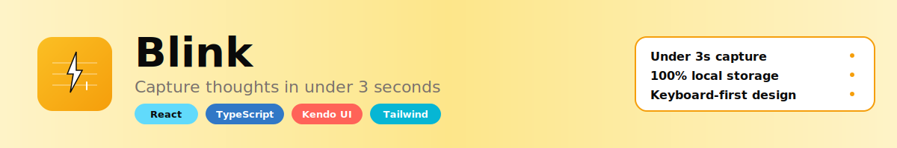
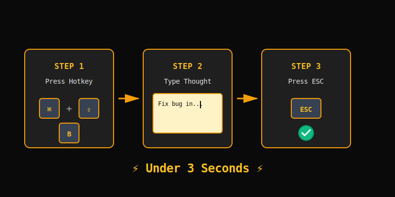

<div align="center">



<h1>Blink</h1>

<p><strong>Capture any thought in under 3 seconds</strong></p>

<p>
  <a href="#the-problem">Problem</a> •
  <a href="#the-solution">Solution</a> •
  <a href="#features">Features</a> •
  <a href="#quick-start">Quick Start</a> •
  <a href="#architecture">Architecture</a> •
  <a href="#tech-stack">Tech Stack</a>
</p>

[](https://react.dev/)
[](https://www.typescriptlang.org/)
[](https://www.telerik.com/kendo-react-ui)
[](https://tailwindcss.com/)

</div>

---

## The Problem

Every note-taking app wants to be your **second brain**. They demand:
- Onboarding flows
- Folder structures  
- Cloud sync setup
- Weekly subscription fees
- Account creation

**By the time you've navigated to the right notebook, the idea is gone.**

The friction of "proper" note-taking kills spontaneity.

---

## The Solution

**Blink** is a browser-based thought capture interface that prioritizes **speed over features**.

<div align="center">



</div>

### The entire interaction takes under 3 seconds:

1. **Hit a global shortcut** - `Ctrl+Shift+B` (or `Cmd+Shift+B` on Mac)
2. **Type your thought** - Cursor is already blinking, ready to go
3. **Press Escape** - Auto-saves instantly to local storage

No account creation  
No cloud configuration  
No formatting decisions  
No friction

---

## Features

<div align="center">


</div>

### Instant Capture
- **Global keyboard shortcut** summons the capture dialog from any browser tab
- **Auto-focused cursor** - start typing immediately
- **No save button** - closing the dialog auto-saves your note
- **Escape key** or clicking outside dismisses and commits to storage

### Slash Commands
Type `/` at the start of any line to trigger templates:

| Command | Result |
|---------|--------|
| `/meeting` | Structured meeting notes with date and attendees |
| `/todo` | Checkbox list for tasks |
| `/idea` | Auto-tagged idea note |
| `/journal` | Daily journal entry with current date |

These commands reduce repetitive typing without cluttering the interface with buttons.

### Pin System
- **Convert notes to floating sticky windows** that persist on screen
- **Draggable** to any position
- **Minimizable** to a bottom bar
- **Always visible** while you work elsewhere
- Replaces physical sticky notes for digital workspaces

### Persistent History
- **All notes stored locally** in the browser
- **Full-text search** with real-time filtering
- **Slide-out sidebar** shows history in reverse chronological order
- **Click any note** to reopen and edit it
- **Delete with confirmation** to prevent accidents

### Daily Streak
- Subtle counter tracks **consecutive days** with at least one captured note
- No notifications or guilt trips
- Just a number that grows if you maintain the habit

### On This Day (Coming Soon)
- Each morning, surfaces notes written on this calendar date in previous years
- Passive resurfacing replaces manual archiving and review

### Export (Coming Soon)
- One-click download of any note as a Markdown file
- Bulk export your entire history as a ZIP of plain text files
- Your data is always portable and never locked in

---

## Quick Start

### Prerequisites
- Node.js 18+ and npm

### Installation

```bash
# Clone the repository
git clone https://github.com/Tasfia-17/blink.git
cd blink

# Install dependencies
npm install

# Start development server
npm run dev
```

Open [http://localhost:5173](http://localhost:5173) in your browser.

### Build for Production

```bash
npm run build
npm run preview
```

---

## Keyboard Shortcuts

| Shortcut | Action |
|----------|--------|
| `Ctrl+Shift+B` (or `Cmd+Shift+B`) | Open capture dialog |
| `Ctrl+Shift+H` (or `Cmd+Shift+H`) | Toggle history sidebar |
| `Esc` | Save and close capture |
| `Ctrl+Enter` | Save and close capture |
| `/` | Show slash commands menu |

---

## Architecture

<div align="center">


</div>

### Project Structure

```
blink/
├── src/
│   ├── App.tsx              # Main application component
│   ├── CaptureDialog.tsx    # Floating capture interface (Kendo Dialog)
│   ├── HistoryDrawer.tsx    # Sidebar with note history (Kendo Drawer)
│   ├── PinnedNotes.tsx      # Floating pinned notes (Kendo Window)
│   ├── storage.ts           # LocalStorage utilities
│   ├── types.ts             # TypeScript interfaces
│   ├── index.css            # Global styles + Tailwind
│   └── main.tsx             # React entry point
├── assets/                  # SVG diagrams and logos
├── public/                  # Static assets
└── package.json
```

### Data Model

```typescript
interface Note {
  id: string;              // UUID
  content: string;         // Plain text content
  createdAt: number;       // Unix timestamp
  updatedAt: number;       // Unix timestamp
  tags: string[];          // Auto-extracted from #hashtags
  isPinned: boolean;       // Pin status
  template?: string;       // Template used (if any)
}
```

### State Management
- **React Hooks** (`useState`, `useEffect`) for local component state
- **LocalStorage** for persistence
- **No global state library** - keeps it simple and fast

---

## Tech Stack

<div align="center">


</div>

### Core Technologies

| Technology | Purpose | Why? |
|------------|---------|------|
| **React 19** | UI framework | Modern, fast, component-based |
| **TypeScript 5.9** | Type safety | Catch errors at compile time |
| **Vite 7** | Build tool | Lightning-fast HMR and builds |
| **Tailwind CSS 4** | Styling | Utility-first, rapid prototyping |
| **Framer Motion** | Animations | Smooth, declarative animations |

### Kendo UI for React Components

| Component | Usage | Why Kendo? |
|-----------|-------|------------|
| **Dialog** | Capture interface | Built-in overlay management, focus trapping, accessibility |
| **Window** | Pinned notes | Draggable, resizable, z-index management out of the box |
| **Drawer** | History sidebar | Smooth slide-in animations, overlay mode |
| **Notification** | Save confirmations | Non-intrusive, auto-dismiss, positioned notifications |
| **Input** | Search box | Accessible, consistent styling |
| **Button** | Actions | Multiple fill modes for visual hierarchy |

### Why Kendo UI?

**Kendo UI for React** is typically deployed in enterprise dashboards and data-heavy admin panels. We wanted to prove these components could be **stripped down and recombined** into something that feels like a **native desktop utility** - fast, focused, and frictionless.

#### Key Benefits:
- **Complex UI made simple** - Kendo handles drag, resize, overlay management  
- **Accessibility built-in** - ARIA attributes and keyboard navigation  
- **Rapid development** - Built in hours, not days  
- **Highly customizable** - Easy to override styles while maintaining functionality  
- **Production-ready** - Battle-tested in enterprise environments  

---

## Design Philosophy

### Distraction-Free Interface
- **Dark mode by default** - easier on the eyes
- **Warm amber accents** - inspired by physical sticky notes
- **Generous whitespace** - centered layout, no clutter
- **Glassmorphism effects** - subtle depth on pinned notes

### Keyboard-First Navigation
- **Every action has a keyboard shortcut**
- **Tab navigation** throughout
- **No mouse required** for core workflows
- **Slash commands** for quick templates

### Speed Over Features
- No user accounts
- No sync (yet)
- No rich text formatting
- No categories or folders
- **Just capture and search**

---

## Use Cases

| User | Scenario |
|------|----------|
| **Developers** | Capturing bug reproduction steps without switching contexts |
| **Writers** | Saving sudden metaphors before they evaporate |
| **Meeting Participants** | Logging decisions without opening a separate application |
| **Anyone** | Who has ever opened Notes.app, waited for sync, created a new note, chosen a folder, and **forgotten what they wanted to write** |

---

## Roadmap

### Phase 1: Core Capture (Complete)
- [x] Global hotkey capture
- [x] Auto-save on close
- [x] LocalStorage persistence
- [x] Slash commands
- [x] Pin system
- [x] History & search

### Phase 2: Enhanced Features (In Progress)
- [ ] Export as Markdown files
- [ ] "On This Day" feature
- [ ] Capture streak notifications
- [ ] Markdown preview mode
- [ ] Keyboard navigation in history (arrow keys)
- [ ] Command palette (Cmd+K)

### Phase 3: Expansion (Future)
- [ ] Optional cloud sync (opt-in)
- [ ] Mobile PWA version
- [ ] Browser extension for true global capture
- [ ] Themes (light mode, custom colors)
- [ ] Note categories/folders
- [ ] Bulk operations (delete, export)
- [ ] Collaboration features

---

## Contributing

Contributions are welcome! Please follow these steps:

1. Fork the repository
2. Create a feature branch (`git checkout -b feature/amazing-feature`)
3. Commit your changes (`git commit -m 'Add amazing feature'`)
4. Push to the branch (`git push origin feature/amazing-feature`)
5. Open a Pull Request

### Development Guidelines
- Keep it **minimal** - every feature must justify its existence
- Prioritize **speed** - no feature should slow down the core capture flow
- Maintain **keyboard-first** navigation
- Write **TypeScript** - no `any` types
- Follow existing code style

---

## License

MIT License - see [LICENSE](LICENSE) file for details.

---

<div align="center">


### Blink

**Capture faster. Think clearer.**

[Star this repo](https://github.com/Tasfia-17/blink) • [Report Bug](https://github.com/Tasfia-17/blink/issues) • [Request Feature](https://github.com/Tasfia-17/blink/issues)

</div>
