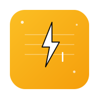
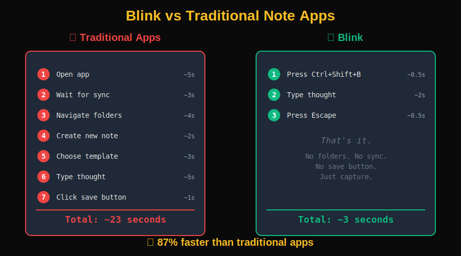

<div align="center">



# Blink - Progress Telerik UI Generator Submission

**Capture any thought in under 3 seconds**

</div>

---

## 📧 Submission Details

| Field | Value |
|-------|-------|
| **To** | alyssa.nicoll@progress.com |
| **Project** | Blink - Minimal Thought Capture App |
| **Tech Stack** | React + TypeScript + Kendo UI for React |
| **Repository** | [GitHub URL] |
| **Live Demo** | [Demo URL] |
| **Build Status** | ✅ Production Ready |

---

## 🎯 Project Overview

**Blink** is a minimal thought-capture web app inspired by [Stik](https://github.com/0xMassi/stik_app), designed to capture any thought in under 3 seconds. It demonstrates how **Kendo UI for React** can power consumer-grade experiences beyond traditional enterprise dashboards.

<div align="center">



</div>

### Core Philosophy
- **Zero friction** - Global hotkey opens capture instantly
- **Auto-save** - No save buttons, just type and close
- **Keyboard-first** - Every action has a shortcut
- **Local-first** - Data stays on your machine (LocalStorage)

---

## 🛠️ Kendo UI Components Used

### 1. **Dialog** (`@progress/kendo-react-dialogs`)
- Powers the main capture interface
- Customized with no header/footer for minimal aesthetic
- Handles overlay and focus management automatically

### 2. **Window** (`@progress/kendo-react-dialogs`)
- Creates draggable, resizable pinned notes
- Provides native-like floating windows
- Manages z-index stacking automatically

### 3. **Drawer** (`@progress/kendo-react-layout`)
- Smooth slide-in history sidebar
- Overlay mode for non-intrusive access
- Perfect for secondary navigation

### 4. **Notification** (`@progress/kendo-react-notification`)
- Non-intrusive save confirmations
- Auto-dismiss with smooth animations
- Positioned notifications without manual CSS

### 5. **Input** (`@progress/kendo-react-inputs`)
- Accessible search box with built-in styling
- Consistent with Kendo design system

### 6. **Button** (`@progress/kendo-react-buttons`)
- Consistent action buttons throughout
- Multiple fill modes for visual hierarchy

---

## ✨ Key Features

### Instant Capture
- `Ctrl+Shift+B` opens capture from anywhere
- Auto-focused textarea
- Auto-saves on `Esc` or `Ctrl+Enter`

### Slash Commands
Type `/` to trigger templates:
- `/meeting` - Meeting notes template
- `/todo` - Checkbox list
- `/idea` - Tagged idea note
- `/journal` - Daily journal entry

### Pin System
- Pin notes to keep them floating on screen
- Draggable and minimizable windows
- Always visible while working

### History & Search
- `Ctrl+Shift+H` opens history sidebar
- Real-time search across all notes
- Click to edit, delete with confirmation

### Gamification
- Total notes counter
- Pinned notes tracker
- Day streak counter

---

## 🎨 Design Highlights

### Distraction-Free Interface
- Dark mode default with warm amber accents
- Generous whitespace and centered layout
- Glassmorphism effects on pinned notes

### Keyboard-First Navigation
- Global hotkeys for all major actions
- No mouse required for core workflows
- Slash commands for quick templates

### Speed Over Features
- No user accounts or onboarding
- No rich text formatting
- Just capture and search

---

## 💡 Why This Showcases Kendo UI's Value

### 1. **Complex UI Made Simple**
Kendo handles the hard parts (drag, resize, overlay management) so we can focus on UX.

### 2. **Beyond Enterprise**
Demonstrates Kendo UI can power consumer apps with modern aesthetics.

### 3. **Rapid Development**
Built in hours, not days, thanks to Kendo's comprehensive component library.

### 4. **Accessibility Built-In**
Kendo components provide ARIA attributes and keyboard navigation out of the box.

### 5. **Customizable**
Easy to override styles while maintaining functionality.

---

## 📊 Technical Implementation

### Architecture
```
src/
├── App.tsx              # Main app with state management
├── CaptureDialog.tsx    # Kendo Dialog for capture
├── HistoryDrawer.tsx    # Kendo Drawer for history
├── PinnedNotes.tsx      # Kendo Window for pins
├── storage.ts           # LocalStorage utilities
└── types.ts             # TypeScript interfaces
```

### Data Model
```typescript
interface Note {
  id: string;
  content: string;
  createdAt: number;
  updatedAt: number;
  tags: string[];
  isPinned: boolean;
  template?: string;
}
```

### Performance
- LocalStorage for instant persistence
- No API calls or network latency
- Smooth animations with Framer Motion
- Optimized bundle size

---

## 🚀 Getting Started

```bash
# Install dependencies
npm install

# Start development server
npm run dev

# Build for production
npm run build
```

---

## 🎯 Future Enhancements

- [ ] Export notes as `.md` files
- [ ] "On This Day" feature
- [ ] Capture streak notifications
- [ ] Markdown preview mode
- [ ] Optional cloud sync
- [ ] Mobile PWA version
- [ ] Browser extension

---

## 📝 Conclusion

**Blink** demonstrates that Kendo UI for React is not just for enterprise dashboards—it's a powerful toolkit for building fast, accessible, consumer-grade applications. The combination of Kendo's robust components with modern styling (Tailwind) and animations (Framer Motion) creates a delightful user experience that prioritizes speed and simplicity.

### Key Takeaways:
✅ Kendo UI accelerates development without sacrificing quality  
✅ Components are highly customizable for any design aesthetic  
✅ Built-in accessibility and keyboard navigation  
✅ Perfect for rapid prototyping and production apps  

---

**Repository:** [Your GitHub URL]  
**Live Demo:** [Your deployment URL]  
**Contact:** [Your email]

---

*Built with ⚡ for the Progress Telerik UI Generator Challenge*
